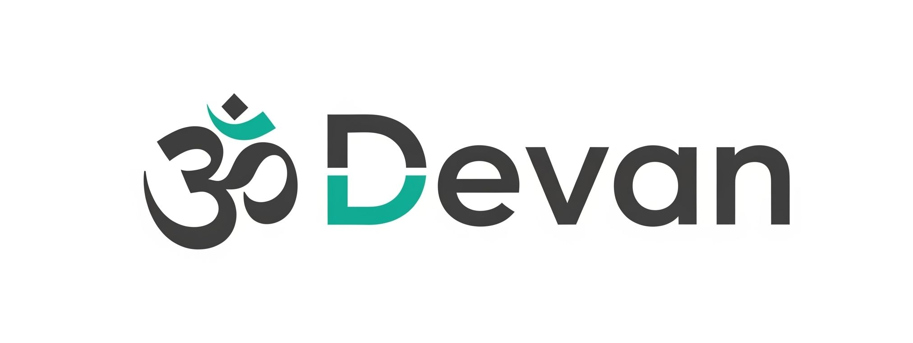

<p align="center">
  
</p>

<h1 align="center">🕉️ Devan Programming Language (.Om)</h1>

<p align="center">
  <b>A Sanskrit-based language powered by Python & PHP</b><br/>
  <a href="https://github.com/NexuzyTech/DevanLang"></a>
  <a href="#"></a>
</p>

---

## 🔹 Overview

Devan is a Sanskrit-style programming language that supports both **interpreting** and **compiling** into Python or PHP. Files are written using `.Om` extension and leverage a custom mapping system from Sanskrit to modern code.

---

## 📦 Features

- 🧠 Interpreter for `.Om` files using Python & PHP
- 🛠 Compiler to `.py` or `.php`
- 📜 Sanskrit-to-Code Mapping (JSON)
- 📦 Auto Installer for Python libraries
- 💻 CLI tool: `devan run` / `devan compile`
- 🧰 PHP Executor
- ✅ Cross-platform (Windows, MacOS, Linux, Ubuntu)

---

## 🧪 Example

**File: `hello.Om`**

```sanskrit
आयातः "गणकसंग्रहः"
मान = गणकसंग्रहः.sqrt(१६)
लेखय "उत्तर:", मान

पीएचपी_कोड = "echo sqrt(16);"
चालय "php", पीएचपी_कोड
```

**Output (Python):**

```python
import math
value = math.sqrt(16)
print("उत्तर:", value)
```

---

## 🚀 Quick Start

```bash
git clone https://github.com/david0154/Devan.git
cd DevanLang
pip install -r requirements.txt
python devan_runner.py run test_files/hello.Om
```

---

## 🛠️ CLI Commands

```bash
devan run hello.Om
devan compile hello.Om --lang python
devan compile hello.Om --lang php
```

---

## 📁 Directory Structure

```
DevanLang/
├── devan_parser.py
├── devan_compiler.py
├── devan_runner.py
├── devan_installer.py
├── devan_php_runner.py
├── devan_stdlib.json
├── requirements.txt
├── logo.png
├── LICENSE
└── test_files/
```

---

## 🤝 Contributing

We welcome contributions! To contribute:

1. Fork the repo
2. Create your feature branch: `git checkout -b feature/AmazingFeature`
3. Commit changes: `git commit -m 'Add feature'`
4. Push: `git push origin feature/AmazingFeature`
5. Open a Pull Request

---

## 📜 License

This project is licensed under the [MIT License](./LICENSE).

---

## ✨ Credits

- **Author**: David  
- **Company**: Nexuzy Tech Pvt Ltd  
- **Email**: nexuzypvtltd@gmail.com

---
